# Cache Me Outside
Category: Binary Exploitation

## Description
> While being super relevant with my meme references, I wrote a program to see how much you understand heap allocations. nc mercury.picoctf.net 8054 heapedit Makefile libc.so.6

## Solution

We have 3 files: `heapedit`, `libc.so.6` and a `Makefile`.

Checking each type or/contents, we find that `heapedit` is an executable:

```
$ file heapedit
heapedit: ELF 64-bit LSB executable, x86-64, version 1 (SYSV), dynamically linked, interpreter /lib64/ld-linux-x86-64.so.2, for GNU/Linux 3.2.0, BuildID[sha1]=6967c296c25feb50c480b4edb5c56c234bb30392, not stripped
```

`libc.so.6` is a shared object (a.k.a shared library):

```
$ file libc.so.6.bak
libc.so.6.bak: ELF 64-bit LSB shared object, x86-64, version 1 (GNU/Linux), dynamically linked, interpreter /lib64/ld-linux-x86-64.so.2, BuildID[sha1]=d3cf764b2f97ac3efe366ddd07ad902fb6928fd7, for GNU/Linux 3.2.0, stripped
```

and the `Makefile` contents are:

```
all:
	gcc -Xlinker -rpath=./ -Wall -m64 -pedantic -no-pie --std=gnu99 -o heapedit heapedit.c

clean:
	rm heapedit
```


So we can see that the executable is supposed to make use of shared objects
located in the same directory as the binary is, i.e: (this is what the `Xlinker
rpath=./` does to the exectuable). This explains why we are provided the
`libc.so.6` file, probably because as we can see (from the `file` command
output) it was linked to a C library that is nowadays (2023) quite old
(GNU/Linux 3.2.0), and thus might not work out of the box with newer C
libraries.

So far so good.

We know also that this CTF relates to heap allocations, but since we don't have
source code we fire up Ghidra.


After creating a new ghidra project, adding both binaries, and analyzing
`heapedit` we start looking as usual to the main function.

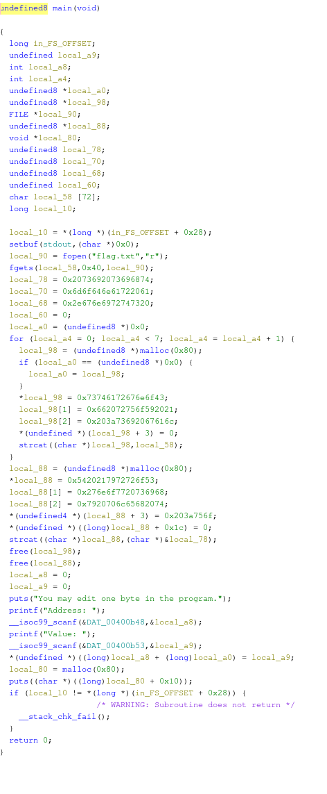 

After *a lot of cleanup* the decompiler should look like this:

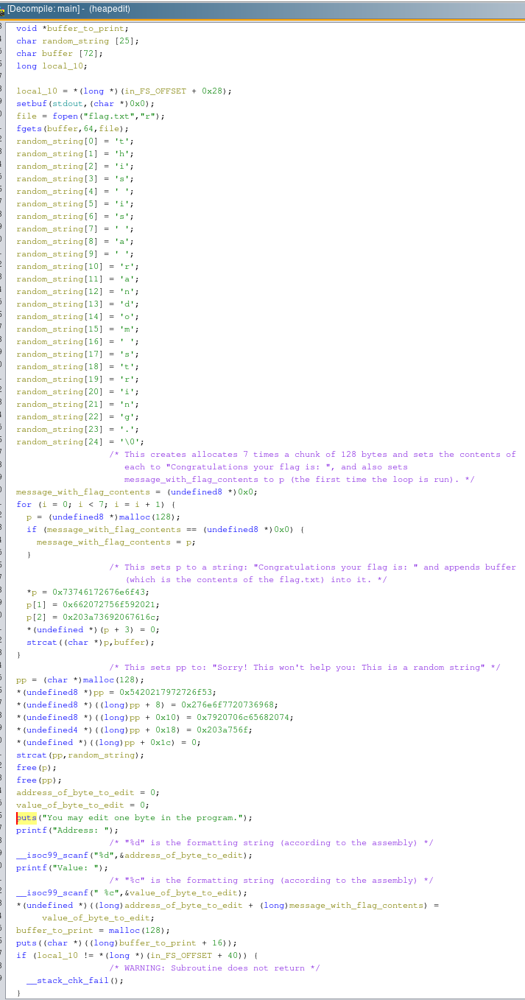 

**TIP 1**: Whenever we have these light blue variables (`&DAT_...`) these are global
variables, either in the .bss or .data section, we can look into the

**TIP 2**: Stack variables that `MOV` a large hex number e.g: `MOV RAX,
0x2073692073696874` and then set it to a pointer and then set same pointer + 1
with another large hex number, and so on, until the last index of that same
pointer is set to `\0`, that probably/usually is an char array in stack and the
large hex numbers are a bunch of ASCII chars. We can change the type of the
variable to char[SOME\_SIZE] and have a neater decompiled code.

**TIP 3**: Adding pre comments are very useful to explain certains snippets of
codes. They help  with context swithing by not needing to reverse engineer again
what is happening in a particular snippet of code when coming back to the
decompiled code after a break.

If we summarize what is happening are these:
* Read the first 64 bytes of file `flag.txt` into `buffer` variable.
* Allocate 7 times a of 128 bytes `p` and write `"Congratulations your flag is: "` and append the `buffer` contents to it.
* Set `message_with_flag_contents` to `"Congratulations your flag is: "` and appended is `buffer` contents.
* Allocate 128 bytes to a `pp`, and set it to `"Sorry! This won't help you: This is a random string"`.
* Deallocate `p` and `pp`.
* Ask to input an address to edit one byte (`address_of_byte_to_edit`).
* Ask to input an value to set that byte in that address (`value_of_byte_to_edit`).
* Sets that `address_of_byte_to_edit` + address of `message_with_flag_contents` to the `value_of_byte_to_edit`.
* Allocates a 128 bytes `buffer_to_print`
* Prints `buffer_to_print` to stdout.
* That's it.

OK we need to change something (probably provinding the address and value) so
the `buffer_to_print` address is actually `message_with_flag_contents`.


Let's try running it first but for that let's download the loader that it
needs. We can do that using [pwninit](https://github.com/io12/pwninit).

```
$ pwinit
pwninit
bin: ./heapedit
libc: ./libc.so.6

fetching linker
https://launchpad.net/ubuntu/+archive/primary/+files//libc6_2.27-3ubuntu1.2_amd64.deb
setting ./ld-2.27.so executable
copying ./heapedit to ./heapedit_patched
running patchelf on ./heapedit_patched
writing solve.py stub
```

This also uses [patchelf](https://github.com/NixOS/patchelf) to modify the elf
rpath to use the libc that is in the same directory (which we already said was
how the linker linked the file in any case), and sets the loader `ld-2.27.so`
to load the executable. It modifies a copy of the executable which is called
`heapedit_patched`.

We can see that if we create a dummy `flag.txt` file it will run:

```
$ ./heapedit_patched
You may edit one byte in the program.
Address: 0xDEADBEEF
Value: t help you: this is a random string.
```

If we didn't have the flag file we would be getting a segfault:

```
$ ./heapedit_patched
[1]    57550 segmentation fault (core dumped)  ./heapedit_patched

```

On the other hand, note that if we tried to run the original executable with
the system's loader (since it's different than the one this was compiled for),
we would run into some weird loader errors.

```
./heapedit
Inconsistency detected by ld.so: dl-call-libc-early-init.c: 37: _dl_call_libc_early_init: Assertion `sym != NULL' failed!
```

OK, getting back on track: Let's try gdb now to see the heap allocations:

**TIP 4**: Use [gef](https://github.com/hugsy/gef) to have a prettier, more ergonomic gdb.

```
gdb ./heapedit_patched
```

and inside we can break on the `malloc` statement which is on `0x4008be` and
the `free` statements which are in `0x4009a3` and `0x4009af`.

```
b * 0x004009be
b * 0x004009a3
b * 0x004009af
```

And then run until the breakpoint. After it stops we can see the heap chunks by simply

```
heap chunks
```

Before the first malloc is executed we can see the chunks are:


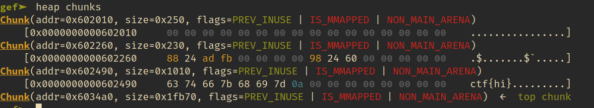 

And after it is executed:

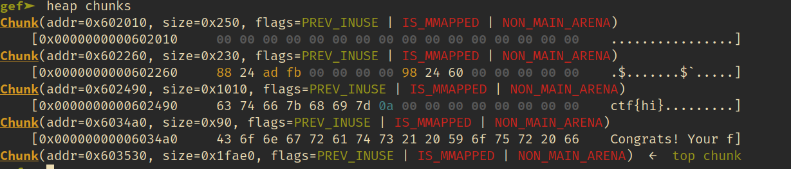 

And after the second time:

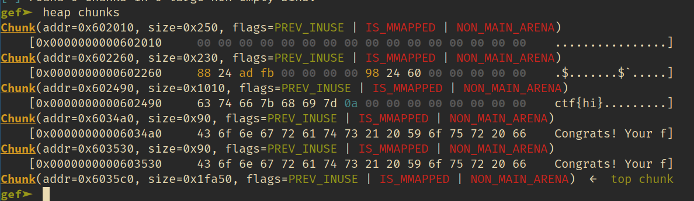 

And so on until we complete the loop and have made all 7 mallocs:

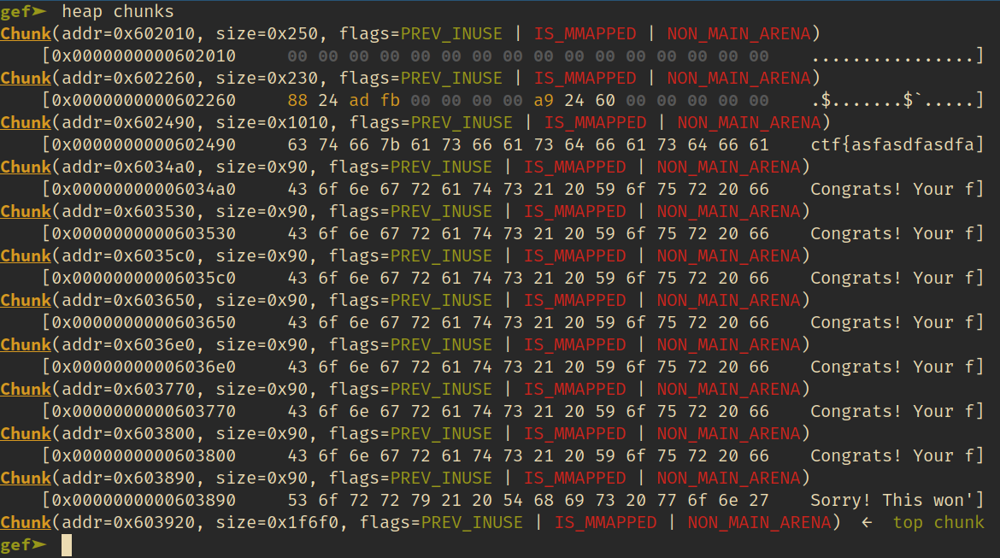 

And note the the heap bins are still empty:

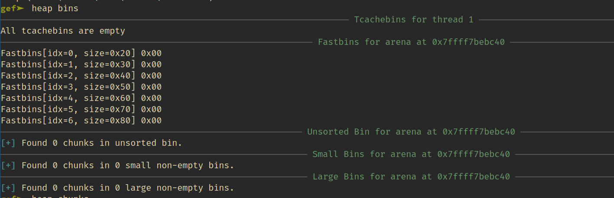

But after the first free is executed, which frees the pointer to `p`, we see
the tcache bin adds that pointer:

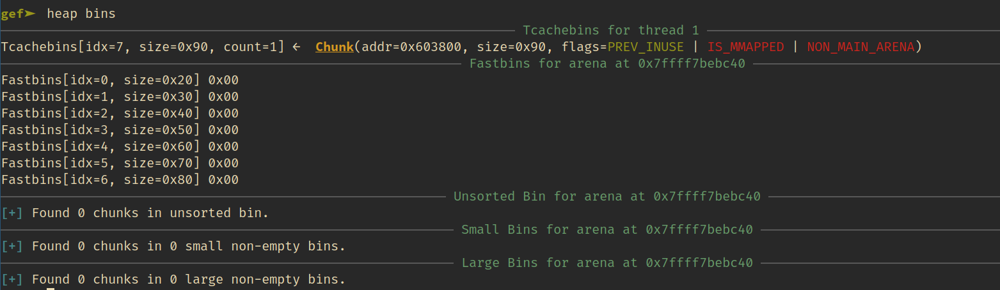 


And after the second free is executed, which frees the pointer to `pp`, we see
the second pointer, prepended to the same tcache bin since they are both
allocations of the:

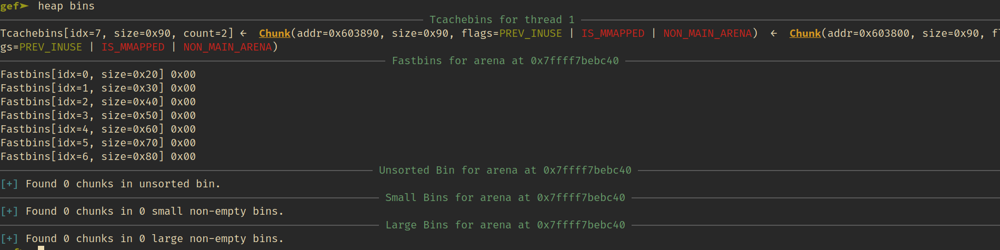 

In addition we can note that the free zeroed some of the first bytes of both of
the chunks:

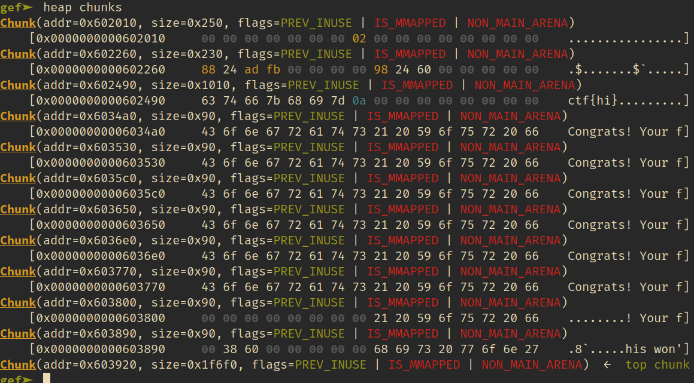 

After trying the address 1 and value 1, and after the last malloc we can see
that the heap bins changed:

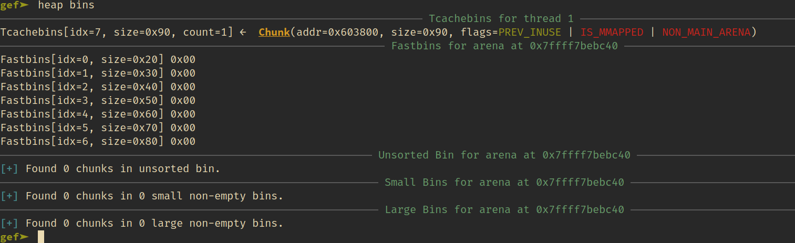

From this last state of the heap bins, (and from knowing how the tcache works)
we can see that the last malloc is reusing the chunk at the top of the tcache
bin which is `0x603890`, which contains the message saying that "this is a
random string", and instead we would like for it to return `0x603800` which is
also part of the tcache bin and so could be reused by the last malloc. So we
want to edit the the address containing `0x603890` into `0x603890`.

To do so, first we search in memory for this pattern:

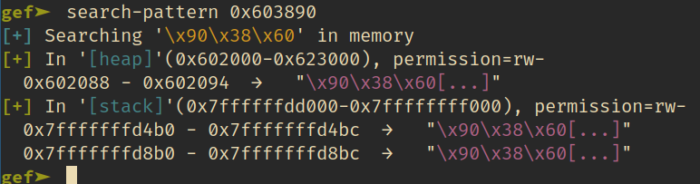 

Great so the address containing it is: `0x602088`!

But according to the code the address that we edit is in fact:
`(long)address_of_byte_to_edit + (long)message_with_flag_contents`, that means
that algebraically: 

`0x602088` = `address_of_byte_to_edit + (long)message_with_flag_contents`

Thus we can derive the `address_of_byte_to_edit` to: `0x602088` -
`message_with_flag_contents`

`message_with_flag_contents` is the address of the first malloc done, which can
be seen from the chunks that is address: `0x6034a0`.

So `address_of_byte_to_edit` resolves to -5144.

And now what value to use? We know that we want to convert the `0x90` at the
end of that address into `0x00`, so we want to pass a single byte of value 0,
but since we know from the code that it is as a char, that means we cannot
simply pass an ASCII 0, since that would have value of 0x30 or 48 in decimal,
we want to pass a NUL char in ASCII, which is a bit tricky to do interactively.

In addition to that, if we try to pass values interactively we find out pretty
quickly that there's another issue with the code, where since `scanf` stops
reading when it sees a newline character (which is the character entered when
we press Enter), the following scanf for the value read from stdin that newline
character and thus, the program will not even prompt for a value of
`value_of_byte_to_edit`.

In order to handle this we can make use of the `solve.py` script created with
the `pwninit` tool, and sending the values using `sendlineafter` and doing it
before the `interactive` call, as well as editing the address of the server
where the actual flag is.

Once we do so we can run the program locally to verify that the flag is
returned and remotely for the actual flag.


## Flag
picoCTF{5c9838eff837a883a30c38001280f07d}
