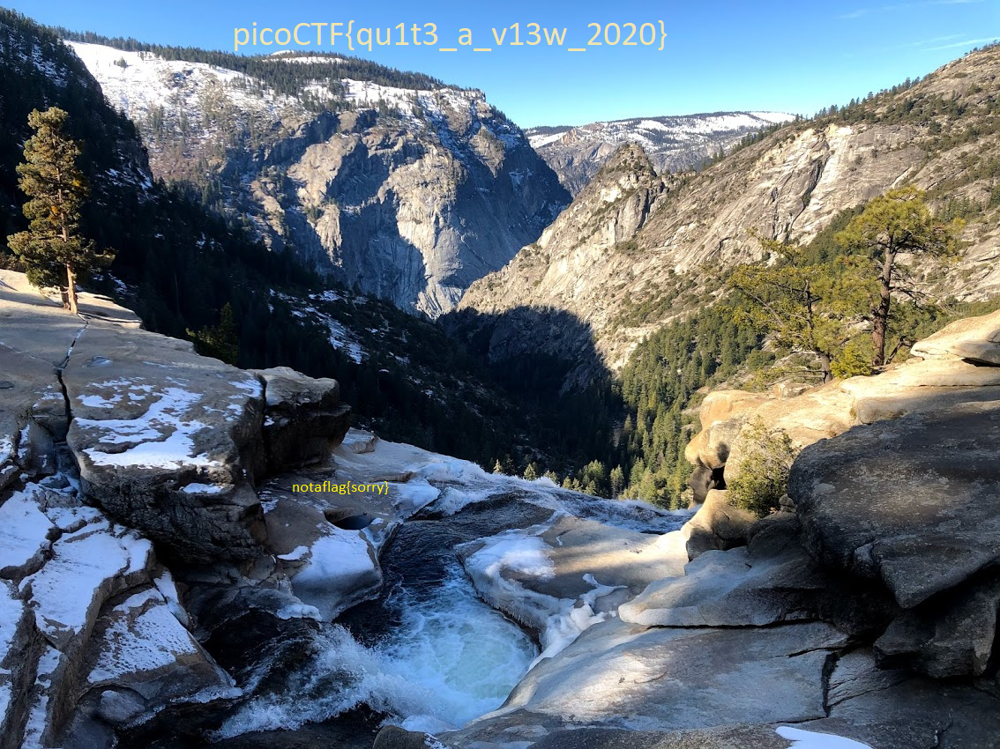

# tunn3l_v1s10n
Category: Forensics, 30 points

# Description
> We found this file. Recover the flag.

# Solution

As usual with the Forensics category, we used `file` get a description of file,
which was described as "data". Next up we tried `hexyl` which is a hex viewer,
to look at the first 30 bytes so that we can see the File Signature a.k.a
Magic Number.


Looking up the [list of file signatures in
wikipedia](https://en.wikipedia.org/wiki/List_of_file_signatures), we find
that the file corresponds to a BMP File, which is a bitmap.

With this information we tried opening the file in an image viewer but it would
throw an error, due to a header being of an invalid size, i.e: the file
seemed corrupt according to the BMP specification.

Then we tried using `ksv` which is the [kaitai struct
visualizer](https://github.com/kaitai-io/kaitai_struct_visualizer), which is a
struct and hex visualizer tool, that allows us to quickly see what bytes of
the hex belong to which part of the file specification.

```
ksv tunn3l_v1s10n bmp.ksy
```

This rendered:

```
[-] [root]                        
  [-] file_hdr
    [.] file_type = 42 4d
    [.] len_file = 2893454
    [.] reserved1 = 0
    [.] reserved2 = 0
    [.] ofs_bitmap = 53434
  [-] dib_info
    [.] len_header = 53434
    [?] color_mask_given
    [?] color_mask_blue
    [?] color_mask_alpha
    [?] color_mask_green
    [?] color_mask_red
    [?] is_color_mask_here
    [?] is_color_mask_given
  [+] bitmap
```

We got a message that mentioned that it attempted to read 53430 bytes but
got only 53416.

Investigating every field that is recognized and comparing with the spec, we
notice that the DIB Header can be one of 7 versions that exists and the
biggest one of the versions has a length of 124 bytes, but `len_header` is
53434 bytes, therefore we try the most common type according to
[Wikipedia](https://en.wikipedia.org/wiki/BMP_file_format#DIB_header_(bitmap_information_header))
which is of type **BITMAPINFOHEADER**, and its length should be 40 bytes
instead of 53434 (`ba d0 00 00`).

**Note** since we are reading these values in a x86-64 processor, the least
significant byte is in a lower memory address i.e: the address in memory where
the header entry starts, points to the least significant byte of those octets.
This is because x86-64 is a little-endian architecture.
This is the reason why `ba d0 00 00` is actually 53434 in decimal and not
3134193664. Because it is read `00 00 d0 ba`.

In addition the **specification mentions that the values are stored in
little-endian as well**.

Editing that header to `28 00 00 00` and opening the file with ksv renders:

```
[-] [root
  [-] file_hdr
    [.] file_type = 42 4d
    [.] len_file = 2893454
    [.] reserved1 = 0
    [.] reserved2 = 0
    [.] ofs_bitmap = 53434
  [-] dib_info
    [.] len_header = 40
    [-] header
      [.] image_width = 1134
      [.] image_height_raw = 306
      [.] num_planes = 1
      [.] bits_per_pixel = 24
      [-] bitmap_info_ext
        [.] compression = compressions_rgb
        [.] len_image = 2893400
        [.] x_resolution = 5669
        [.] y_resolution = 5669
        [.] num_colors_used = 0
        [.] num_colors_important = 0
      [?] extends_bitmap_v4
      [?] extends_bitmap_v5
      [?] uses_fixed_palette
      [?] image_height
      [?] len_header
      [?] bottom_up
      [?] is_core_header
      [?] extends_bitmap_info
      [?] is_color_mask_here
      [?] extends_os2_2x_bitmap
    [+] color_table
```

And if we open the image we see


Which clearly says "notaflag{sorry}"

Looking again at the spec, we notice that the `ofs_bitmap` should point to the
bitmap but instead it has 53434 which is the same wrong value used for the
`len_header` of the DIB header. 
Considering the File Header is 14 bytes and the DIB Header is 40 bytes, then
the offset should be 54 bytes or in hex: `0x36`. So we edit that and get the
following image:


Which looks like a real picture of a small creak with rocks and snow their
actual colors, but still mentions the "notaflag{sorry}".

Looking at the file again with kaitai and everything looked OK: 

```
[-] [root
  [-] file_hdr
    [.] file_type = 42 4d
    [.] len_file = 2893454
    [.] reserved1 = 0
    [.] reserved2 = 0
    [.] ofs_bitmap = 54
  [-] dib_info
    [.] len_header = 40
    [-] header
      [.] image_width = 1134
      [.] image_height_raw = 306
      [.] num_planes = 1
      [.] bits_per_pixel = 24
      [-] bitmap_info_ext
        [.] compression = compressions_rgb
        [.] len_image = 2893400
        [.] x_resolution = 5669
        [.] y_resolution = 5669
        [.] num_colors_used = 0
        [.] num_colors_important = 0
      [?] extends_bitmap_v4
      [?] extends_bitmap_v5
      [?] uses_fixed_palette
      [?] image_height
      [?] len_header
      [?] bottom_up
      [?] is_core_header
      [?] extends_bitmap_info
      [?] is_color_mask_here
      [?] extends_os2_2x_bitmap
    [+] color_table
```

At this point we looked more closely into each of the fields of the file, and
one thing to note is the field `len_image` which is part of the DIB header
(or `dib_info` in kaitai).

The size of the image is: `2893400` or `2.8 MiB`, and that should be the
result of the image's area in pixel * bits per pixel / bits per byte, but
doing the math,
using the values in the field given:

```
1134 * 306 * 24 / 8  = 1041012
```

1041012 or 1.04 MiB is less than 2.8MiB, and considering the image seems hires
but has unusually short resolution in the height, we can try to increase the
height to a reach that 2.8MiB of info.

```
2893400 * 8 / (24 * 1134) = 850.49
```

Let's round down to 850, but it doesn't matter if you round down or up as we
would simply be having wrong metadata as we know this file has, so we edit the
height of the image to 850, this means changing position `0x16` with values
`32 01 00 00` into `52 03 00 00`.

And opening the image now finally reveals the flag: 



As a side note this CTFs would not have been possible to finish if it wasn't
for the help of my friend and hacker [Roger](https://github.com/Roger) and his
endless imaginative mind. Thanks for all the fish, Marvin!


# Flag
picoCTF{qu1t3_a_v13w_2020}
